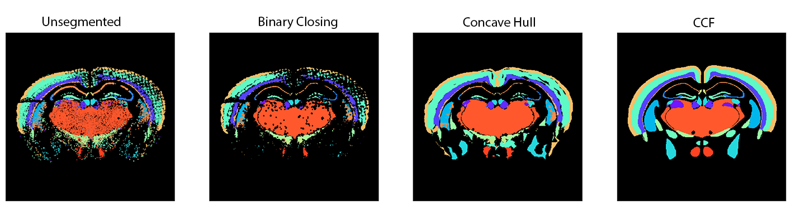
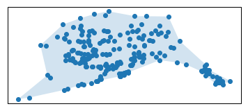
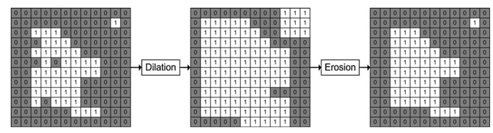

# Segmentation - sptx_ccf_registration.segmentation



## Quick start

1. Segment broad labels with concave hull, with `default_alpha = 0.2`

   Setup paths in `sample_config/segmentation/segmentation_broad.json`.
  
   Run segmentation with command:

   ```bash
   python -m sptx_ccf_registration.segmentation --input_json sample_config/segmentation/segmentation_broad.json
   ```

2. Segment landmark labels with an optimized alpha strategy and manually selected optimal alpha values for each (z-slice, label).  
   
   Setup paths in `sample_config/segmentation/segmentation_landmark.json`
   
   Optimal alpha values are chosen for `Mouse3_v2` in `sample_config/segmentation/alpha_selection.csv`
   
   Run segmentation with command:

   ```bash
   python -m sptx_ccf_registration.segmentation --input_json sample_config/segmentation/segmentation_landmark.json
   ```

3. View QC plots in `<output_dir>/<segmented_label_file_prefix>/alpha_qc`

4. Optional: refine parameters and rerun

## Overview

This module offers three methods of segmentation of point clouds

1. **Concave hull** - a shape enclosing set of points

   

2. **Binary closing** (dilation and erosion) - dilation fills in gaps and holes which is followed by erosion that retracts the outside boundary back to its original shape

   

3. **Hybrid** - for each individual (z-slice, label), select either concave hull or dilation

Methods for QC plots to visualize the segmentation with a range of parameters against the unsegmented and the CCF labels can aid in evaluation of the segmentation and parameter selection.

### Concave Hull

Concave hull requires selection of an alpha parameter. The alpha parameter defines the granularity of the boundary with smaller values < 0.05 approximating convex hull and larger values > 0.2 approximating binary closing.

This may need to be optimized for each individual (z-slice, label) in cases where labels have varying densities, granularity of structures, and artifacts that need to be filled.  

This individual (z-slice, label) selection follows three steps (each z-slice is processed independently)

1. Select a default_alpha that's applied to all labels
2. If a MERFISH label has a corresponding CCF label, select the alpha parameter that minimizes the difference in area between the segmented MERFISH label and the corresponding CCF label
3. Manually select an alpha parameter based on visual QC plotting by storing the parameter value in respect to a (z-slice, label).

### Binary Closing

This method has a radius parameter. This defines the radius of the structural element that's used in dilation and erosion. A larger radius will fill in larger holes and gaps but at the tradeoff of filling in details in between structures. 

### Plotting

Parameter selection and segmentation evaluation is aided with visualizations.

## Usage

Parameters setup

`python -m sptx_ccf_registration.segmentation --help`

```
SegmentationSchema:
  --output_dir OUTPUT_DIR
                        Output directory. (REQUIRED)
  --segmented_label_output_file SEGMENTED_LABEL_OUTPUT_FILE
                        Output file. (REQUIRED)
  --default_alpha DEFAULT_ALPHA
                        Default concave hull alpha value if alpha is not selectedthrough optimize_alpha or alpha_selection_path (default=0.2)
  --optimize_alpha OPTIMIZE_ALPHA
                        Optimize concave hull alpha parameter for each(z-slice, label) by minimizing difference in area with respective CCF. (default=False)
  --min_alpha MIN_ALPHA
                        Lower boundary of search in optimize_alpha. (default=0.04)
  --max_alpha MAX_ALPHA
                        Upper boundary of search in optimize_alpha. (default=0.45)
  --min_points MIN_POINTS
                        Minimum number of points in a label required for segmentation. (default=10)
  --sigma SIGMA         Sigma parameter used for gaussian smoothing to estimate densityof each label. For overlapping labels, the densest estimated label isselected. (default=5)
  --radius RADIUS       Radius parameter used for binary closing to dilate labels. (default=5)
  --save_alpha_qc SAVE_ALPHA_QC
                        Whether to save alpha QC images. (default=False)
  --force_binary_closing FORCE_BINARY_CLOSING
                        If true, all segmentation will be done using binary_closing insteadof concave hull. All concave hull related parameters will be ignored (default=False)
  --seed SEED           Seed for random number generator. (default=2021)
  --n_processes N_PROCESSES
                        Number of processes to use.If -1, use all available cores. (default=-1)

input_paths:
  Input files.

  --input_paths.unsegmented_label_file INPUT_PATHS.UNSEGMENTED_LABEL_FILE
                        Input file. (REQUIRED)
  --input_paths.ccf_file INPUT_PATHS.CCF_FILE
                        Path of the CCF file.
  --input_paths.itksnap_file_path INPUT_PATHS.ITKSNAP_FILE_PATH
                        Path of the itksnap file.
  --input_paths.alpha_selection_path INPUT_PATHS.ALPHA_SELECTION_PATH
                        Path of the alpha selection file.
```